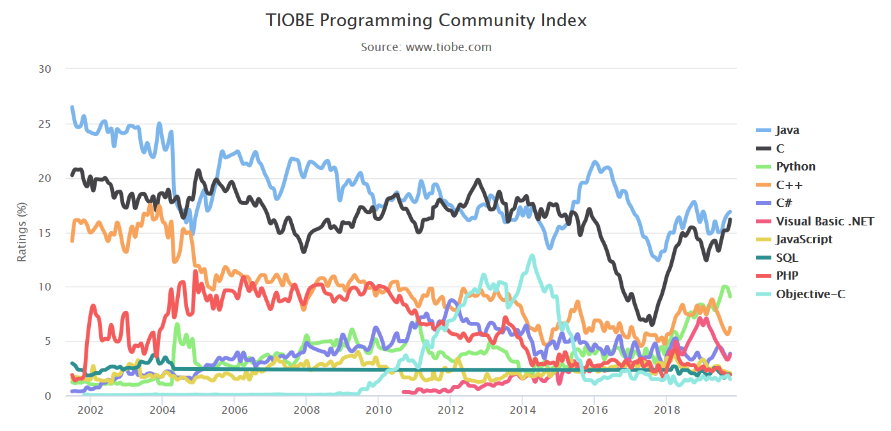

### Aimed audiences

For **intermediate C++ programmers**

 to improve the performance and robustness of the large scale software.

+ safer scientific computation
+ some C++ pitfalls
+ design large scale software (yet completed)
  - C++ wrapping for Python, or other interpreting languages

---

# Introduction to C++

## what is C++

Object oriented (OO) version of C, "C with [Classes](https://en.wikipedia.org/wiki/Class_(programming))"

A superset of C

but not the only extension of C:  objective-C, D, etc.

---
### then what is C language?
 C is born with Unix OS from Bell lab in early 1970s.

Nowadays, most operation systems (OS) is written in C, Linux kernel

Many high level language runtime are written in C(Python)/C++(javascript)

Unique: Pointer (address to raw memory space) and full control memory

Power: C can be mixed with assembly language

---
### C++ features over C
+ object oriented paradigm
+ generic programming by template  `std::vector<int> ints;`
+ namespace to avoid name clash
+ functional programming, `std::fuction, lambda`
+ exception (try-catch-finally)
+ RTTI: runtime type information, but not as powerful as Java/C#

---

## why C/C++ (pros)
+ fundamental: operation system, device driver
+ performance: compiling language as Fortran
+ versatile: Object-orientation, template/generalized, functional
+ vast third-party libraries
+ shared feature with C family languages: C#, Java, Objective-C, etc

+ suitable for large scale software design, HPC
e.g. CFD software Ansys Fluent from Fortran to C++
---
## Popularity of C and C++


The combination of C and C++ takes the lead in Tiobe rankings.

---

## C++ standards
+ C++ invented by Bjarne Stroustrup in 1985
+ the firs standard C++ 98,  standard library (STL) was not available
+ C++11 (modern C++) and C++17/C++20 have some exciting/modern features
  - `std::thread`, `std::function`, `lambda`, `std::tuple`, smart pointers
  - `filesystem`(C++17), traits

+ some can not wait for a better C++: *rust, go* are invented before C++11 published

---

## why not C++ (Cons)

+ C++ grammar is too complicate
 - confusing keyword `using` and `static`
 - too many integer types, java has only one
 - pointer, reference
 - polymorphic only apply to pointer/reference
 - no memory manager/garbage collector

+ less featured standard libraries, vs. python, Java, C#, etc
  however, C++ has lib and frameworks like boost, Qt

+ less productivity:
    on average, 50 lines of production code
   [The Programmer Productivity Paradox ](https://dzone.com/articles/programmer-productivity)
---

### try out using c++ online compilers
There is a list of online compiler to try C++ in webbrowser

<https://arnemertz.github.io/online-compilers/>

Cppinsights: see how compiler do the compiling
<repl.it>: can save user's code snippet, as it is used in this lesseon

---
# Safer computation in C++

## the jungle of integer types

```cpp
//signed
char
short
int
long
long long
// and with their unsigned version
```
What is the size of `int` and `long` do you think?

<a href="https://repl.it/@qingfengxia/printcpptypesize">run example by online compiler</a>

---
it depends on CPU, OS, even compiler target (32 or 64bit)
```cpp
// here we only consider 32 and 64bit OS
void*  // identifed from memory address pointer byte size
//signed and unsigned integer has the same length
char 1 byte
short  2 bytes
int     4 bytes
long   depends on OS, compiler settings
long long  8bytes
```
windows 64bit, has `long` just 4 bytes, while on Linux it is 8 bytes (64bits)

`size_t` returned by `sizeof` operator and  `std::vector.size()`
it is 64bits on both uint64_t on 64bit windows and Linux system, while 32bit unsigned integer `uint32_t`

---
## integer types and conversion
```cpp
void std_container_index_test(){
    std::vector<int> v;
    int index= 10;
    if (index < v.size()-1) // there is a compiler warning here
        std::cout << v[index];
}
```
<a href="https://repl.it/@qingfengxia/stdcontainerindextest"> run examle by online compiler</a>
---
### float point type and precision

<https://en.wikipedia.org/wiki/Double-precision_floating-point_format>,
IEEE754-2008 standard

- 16bit half precision, widely used in GPU
- 32bit single precision, `float`, at least 9 significant digits
- 64bit double precision, `double` for short in  C/C++
- 128-bit: Quadruple (binary128), barely any CPU support this natively
- `long double` depends on compiler implementation
---

## implicit conversion (1) C language features
### algorithmic promotion

+ safe from smaller type (smaller in byte size, range) to bigger type
   from `char -> short -> int ->long -> long long`
   from `unsigned int -> signed long long`

+ from `half->float->double->long double`

+ same width: `signed int -> unsigned int`, it is potentially dangerous!

   see example code in later section

+ `enum` is `int` if the underlying type is not explicitly specified

---
### numerical conversion
+ if there is no rule for promotion, it is an conversion
   -  e.g. floating–integral conversions
   - The programmer need to care about out of range, loss of precision

+ mixing of signed and unsigned integer of size byte size

  from `signed int -> unsigned long long`

```cpp
      int n = -1;
      unsigned int u = 1;
      std::cout << "Comparing signed and unsigned:\n"
                << " -1  < 1? " << (n < u) << '\n'
                << " -1  > 1? " << (n > u) << '\n';
```

  see example <https://en.cppreference.com/w/cpp/language/operator_comparison>

---

### Boolean conversion

+ from bool to integer
  - bool to int: true => 1, false => 0
  - many c++ type can be converted into bool type
  - if a customed type can converted into, but further into integer should be forbidden
  e.g. `if(std::cin) {...}` is wanted, but `int n = std::cout;` must be avoided, then
  `explicit operator bool() const { ... }`

see more details: <https://en.cppreference.com/w/cpp/language/implicit_conversion#Integral_promotion>

---
## implicit conversion (2) C++ object oriented
### implicitly cast to base/parent type pointer/reference
this is the polymorphic, the essence of object oriented programming

Pointer conversions:
   from a type pointer to `void`,

   from `nullptr` to any type pointer

### if constructor with single parameter exists

```cpp
const char* c_string = "hello world";
std::string s = c_string;
```
---
### prevent implicit conversion

```cpp
#include <iostream>
class A {
    bool b;
public:
	A(bool param)  // use `explicit` to see the difference
    { std::cout<<"bool actor called with param =" << param << std::endl; }
    explicit  operator bool() {return b;};
};
int main(){
    A a = A(1);  // int -> bool, no compiler warning, but maybe not what you want
    A b(2.3); // double -> bool, no compiler warning, but maybe not what you want
    A c = true;  // compiler error if the constructure is protected by `explicit`
    A d = 1.5;  // compiler error if the constructure is protected by `explicit`
}
```
C++ keyword `explicit` qualified constructor can avoid this

---
### explicit cast in C++

static_cast<T>  conversion at compiling time, safer
```cpp
    double d = 123456.789;
    float f = static_cast<float>(d);
    // silly, I messed up the value type and pointer type
    float* pf = static_cast<float*>(d);
```
dynamic_cast<T> conversion at runtime
const_cast<T>
any_cast<T>  from `std::any` unbox to more specific type

---
## exception/error in math computation

### integer underflow/overflow

- CPU set status register, which may be checked by C and C++

- C lib: `errno` set and clear by library function

  <https://www.gnu.org/software/libc/manual/html_node/Errors-in-Math-Functions.html>

  <https://en.cppreference.com/w/c/error/errno>

- C++ way to detect under/overflow

Note: know and detect your integer range in runtime

 `std::limits<long>::max()`

------

### float point exception and special values

NaN,  +Inf, -Inf

```c
    printf("sqrt(-1) = %f\n", sqrt(-1));
    printf("DBL_MAX*2.0 = %f\n", DBL_MAX*2.0);
    printf("DBL_MAX*-2.0 = %f\n", DBL_MAX*-2.0);
```

those 3 special values operates with a valid number resulting in those special values

------

### setup float point exception check in C++

This is a C99 feature

```cpp
    if(fetestexcept(FE_DIVBYZERO)) printf(" FE_DIVBYZERO");
    if(fetestexcept(FE_INEXACT))   printf(" FE_INEXACT");
    if(fetestexcept(FE_INVALID))   printf(" FE_INVALID");
    if(fetestexcept(FE_OVERFLOW))  printf(" FE_OVERFLOW");
    if(fetestexcept(FE_UNDERFLOW)) printf(" FE_UNDERFLOW");
    feclearexcept(FE_ALL_EXCEPT);
```

<https://en.cppreference.com/w/c/numeric/fenv/FE_exceptions>

---

# The complexity of C++
## reused keyword `using`

+ typedef  `using mytype=std::size_t;`
+ shortening name space `using std;`
+ `using BaseClass::BaseClass;`

It is confusing, but not dangerous!
C++ does not stop you from doing silly and dangerous things, for the sake of performance

---
## confusing keyword `static` (1)

C legacy:
+ in cpp file, but before the function name/declaration
+ inside a function scope, to modify a variable
```cpp
static f(int i) {
    static sum = 0;
    sum +=i;
    return sum;
}
int main{
cout<<f(1)<<endl;
cout<<f(1)<<endl;  // what do  you expect the print?
}
```
see also <https://en.cppreference.com/w/cpp/keyword/static>

---
### confusing keyword `static` (2)
 C++ object oriented programming header
```
class C
{
    static sum = 0;
    static getClassName();
}
```

*note* `static` should be avoid in multi-threading program

---
##  pointer vs. reference => smart pointer

The difference

| type          | Pointer                                        | Reference                            |
| ------------- | ---------------------------------------------- | ------------------------------------ |
| meaning       | has the value of memory address                | another name to an existing variable |
| initial value | can be `nullptr`, i.e. uninitialized condition | must assign a valued value           |
| reassign      | allowed, except for `const T * pointer`        | not allowed                          |
| be null?      | yes, widely used                               | `**int \*p;...int &r = \*p;**`       |
| bool op       | `if(pointer)` to test whether it is nullptr    | `if(reference)` call `bool operator` |

Reference does not solved the memory management problem, `dangling reference`

**using smart pointer of C++11**, can be a better choice to pass objects around safely.

## pitfalls of object oriented programming
+ virtual destructor for base class
+ polymorphic only apply to pointer/reference
+ multiple inheritance (MI)

---
### MI and diamond problem

https://www.geeksforgeeks.org/multiple-inheritance-in-c/

---
# design large scale software

## Software architecture
```cpp
// the software is like a house
// namespace as component contains more classes
namespace FrontWall{
    class Brick {
        int sand = 1;
        ...
```
---
### stand on giant shoulder
[awesome C++](https://github.com/fffaraz/awesome-cpp)    [awesome modern C++](https://github.com/rigtorp/awesome-modern-cpp)

+ libraries

+ learning material, video, blogs, books, talks conferences

+ useful tools: IDE, profilers, build, package and code analyzer

---
### design pattern

---
### Base class and type system for C++
Compared with other compiling languages like C# and Java, C++ does not provide  a type system, neither a base class. Here is an implementation, extracted from FreeCAD project
<https://github.com/qingfengxia/cppBase>

There is no need to write factory class, but register a type by simple macro
(only achievable by macro).
```cpp
    Base::BaseClass* bc = static_cast<Base::BaseClass*>(Base::Type::createInstanceByName("CClass"));
    CClass* c2 = type_dynamic_cast<CClass>(bc);
```
see the full example <https://github.com/qingfengxia/cppBase/blob/master/TypeTest.cpp>

---
## C++ and Python

### python and C++ are good companions
  python is an interpreter lang, for fast prototyping
  C++ codes run fast for large program and HPC

  a few CPython standard modules are re-written in C/C++ for better perfomance
  There are various methods to export C++ API as python module.
  see more example and cmake/setup.py integration at

 <https://github.com/qingfengxia/python_wrap>
---

### Wrapping C++ code to other languages

`swig` can wrap C/C++ to many languages, C#, Java, javascript, python, ruby, etc
using the `interface.i` file

---

### `numba` JIT example
```python
from numba import jit
@jit
def create_fractal(min_x, max_x, min_y, max_y, image, iters):
    height = image.shape[0]
    width = image.shape[1]

    pixel_size_x = (max_x - min_x) / width
    pixel_size_y = (max_y - min_y) / height
    for x in range(width):
        real = min_x + x * pixel_size_x
        for y in range(height):
            imag = min_y + y * pixel_size_y
            color = mandel(real, imag, iters)
            image[y, x] = color
    return image
```
full example at <https://numba.pydata.org/numba-doc/dev/user/examples.html>

